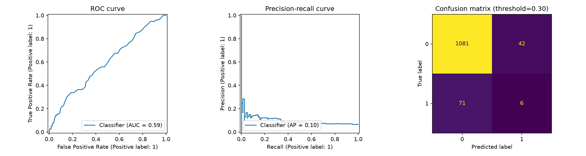
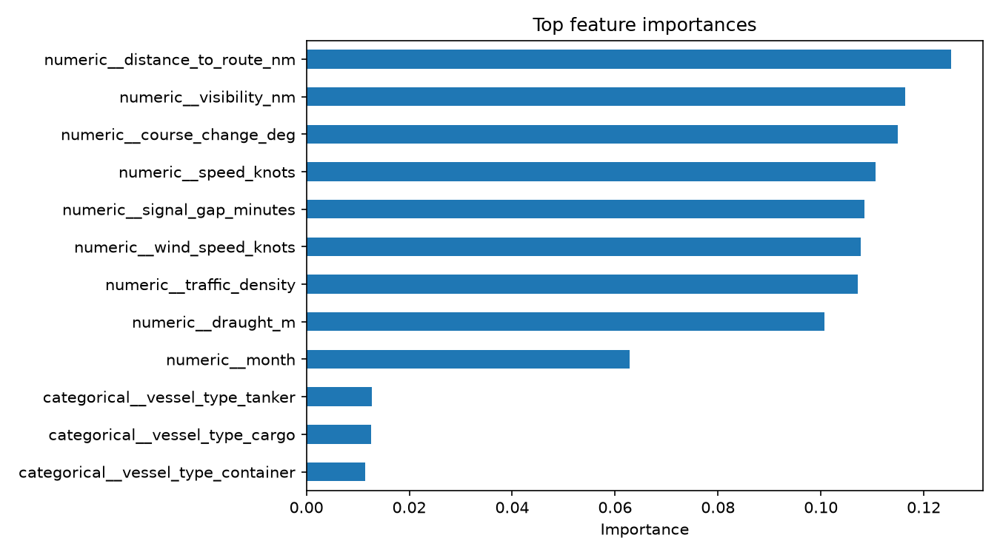

# Maritime Vessel Anomaly Detection

An interpretable machine-learning baseline for detecting unusual vessel behavior from operational and environmental signals.

## Why this project

Shipping systems produce many signals at once: speed, course changes, route distance, draught, weather, visibility, traffic density, and AIS signal gaps. This project turns those signals into a reproducible anomaly-detection workflow that can be inspected, tested, and extended.

## Dataset

The included synthetic dataset contains 6,000 vessel observations with:

- vessel type and seasonality
- speed, course-change angle, route distance, and draught
- wind, visibility, and traffic density
- AIS signal-gap duration
- binary `anomaly` target

The data is synthetic and is intended for engineering demonstration and model prototyping, not operational decisions.

## Quick start

```powershell
python -m venv .venv
.\.venv\Scripts\Activate.ps1
pip install -r requirements.txt
python train.py
```

The training script prints a classification report and saves a feature-importance chart to `outputs/feature_importance.png`.

## Baseline snapshot

The reproducible baseline uses an 80/20 stratified split and a screening threshold of `0.30`:

| Metric | Normal (0) | Anomaly (1) |
| --- | ---: | ---: |
| Precision | 0.938 | 0.125 |
| Recall | 0.963 | 0.078 |
| F1 | 0.950 | 0.096 |

Overall ROC-AUC is `0.590` on the held-out split. The result is intentionally treated as a starting point: the rare anomaly class and weak signal separation make threshold selection, calibration, temporal splits, and stronger features important next steps. The script also exports `outputs/evaluation_curves.png` for visual inspection.





## Workflow

1. Load and validate the tabular data.
2. One-hot encode categorical vessel type.
3. Train a reproducible Random Forest baseline.
4. Apply a documented screening threshold and report precision, recall, F1, ROC-AUC, and confusion matrix.
5. Export model diagnostics for inspection.

## Engineering principles

- reproducible random seed
- explicit feature list
- no hidden network calls
- validation before training
- clear separation between data, source code, and outputs
- transparent reporting of class imbalance and baseline limitations

## Next improvements

- compare calibrated tree models and gradient boosting
- add temporal and vessel-level split strategies
- evaluate class imbalance and threshold selection
- connect the feature pipeline to live AIS data only after source and geofence validation

## License

MIT
